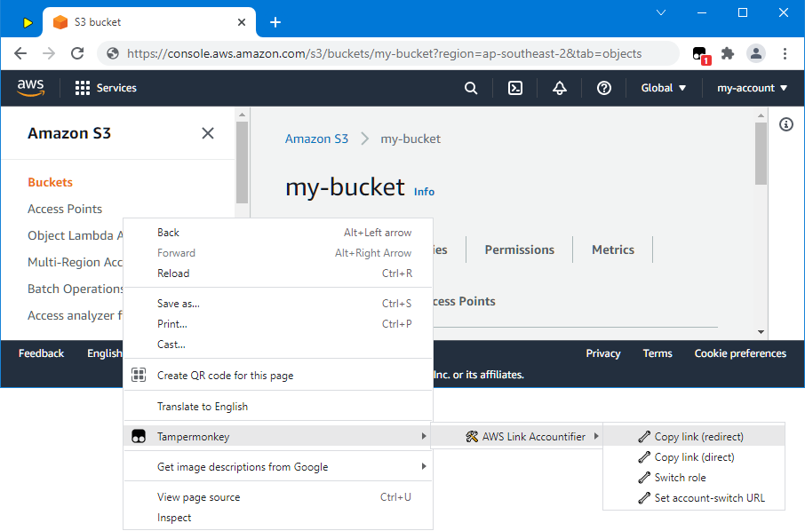

# aws-link-accountifier

A [Tampermonkey](https://www.tampermonkey.net/) script to create account-specific links to the AWS Management Console. When opened, these links prompt/redirect the user to switch to the right AWS account (if currently logged into another one). Although everyone can open "accountified" links, the prompting/redirecting only occurs if the `aws-link-accountifier` is installed.

## Overview

In the AWS Management Console, the Tampermonkey context menu contains items to copy the current URL as an accountified link:



Apart from the URL itself, accountified links also contain additional information about the required AWS account:

```
https://david-04.github.io/aws-link-accountifier/aws-accountified-redirect.html#%7B%22account%22%3A%7B%22id%22%3A%22000000000002%22%2C%22alias%22%3A%22my-account%22%2C%22exampleRole%22%3A%22my-account-read-only%22%7D%2C%22url%22%3A%22https%3A%2F%2Fconsole.aws.amazon.com%2Fs3%2Fbuckets%2Fmy-bucket%3Fregion%3Dap-southeast-2%26tab%3Dobjects%22%7D
```

Decoded, the above URL's hash looks like this:

```json
{
    "account": {
        "id": "000000000002",
        "alias": "my-account",
        "exampleRole": "my-account-read-only"
    },
    "url": "https://console.aws.amazon.com/s3/buckets/my-bucket?region=ap-southeast-2&tab=objects"
}
```

When opening an accountified link, the `aws-link-accountifier` checks the current browser session. If it doesn't match the required AWS account, it triggers an account-switch. The URL can be configured. The role selection screen contains advice about which account to choose:


Similarly, when using the AWS role-switch feature, the account details are pre-populated automatically:


Once logged in to the right account, the `aws-link-accountifier` redirects to the original link:


The `aws-link-accountifier` simplifies bookmarking and role-switching when working with different AWS accounts.

## Installation

- Install the [Tampermonkey](https://www.tampermonkey.net/) browser extension.
- Open the extension's options.
- Go to the `Utilities` tab and scroll down to the `Install from URL` section.
- Paste the following URL into the input field:
  <https://raw.githubusercontent.com/david-04/aws-link-accountifier/main/dist/aws-link-accountifier.js>
- Click on the `Install` button.
- On the confirmation page, click the `Install` button.
- Reload AWS Management Console tabs to activate the script.

## Usage

All `aws-link-accountifier` features can be accessed via Tampermonkey's context menu:


They are also accessible via the toolbar:


### Creating links

To create a link, open the respective page in the AWS Management Console and select one of the two "Copy link (...)" options from the menu. There are two different types of links - direct and redirected.

Direct links use the AWS Management Console URL as the base. Account information is appended as an additional hash, e.g.:

```
https://console.aws.amazon.com/s3/buckets/my-bucket?region=ap-southeast-2&tab=objects#aws-link-accountifier=%7B%22account%22%3A%7B%22id%22%3A%22000000000002%22%2C%22alias%22%3A%22my-account%22%2C%22exampleRole%22%3A%22my-account-read-only%22%7D%7D
```

When opening such a link, the `aws-link-accountifier` removes the extra metadata and reloads the page. However, this does not happen if the `aws-link-accountifier` is not installed. In those cases, the extra hash _might_ interfere with the AWS Management Console and the link might not display as expected. 

To prevent this, it's recommended to use redirect links. Rather than pointing directly to the AWS Management Console, these links pass through an intermediate page, e.g.:

```
https://david-04.github.io/aws-link-accountifier/aws-accountified-redirect.html#%7B%22account%22%3A%7B%22id%22%3A%22000000000002%22%2C%22alias%22%3A%22my-account%22%2C%22exampleRole%22%3A%22my-account-read-only%22%7D%2C%22url%22%3A%22https%3A%2F%2Fconsole.aws.amazon.com%2Fs3%2Fbuckets%2Fmy-bucket%3Fregion%3Dap-southeast-2%26tab%3Dobjects%22%7D
```

When opening such a link, the `aws-link-accountifier` extracts the account details and then redirects the browser to the AWS Management Console. If the `aws-link-accountifier` is not installed, the redirect page itself discards the account details and redirects the browser to the plain URL.

By default, redirect links point to <https://david-04.github.io/aws-link-accountifier/aws-accountified-redirect.html>. But it is strongly recommended that you download [aws-accountified-redirect.html](https://raw.githubusercontent.com/david-04/aws-link-accountifier/main/dist/redirect/aws-accountified-redirect.html) and host it on a domain (or S3 bucket) that you control. See the "Configuration" section below for setup instructions.

### Switching roles

The context menu also contains a `Switch role` command. It initiates an instant role-switch and is useful when an account has multiple roles with different permissions. For example, you might be logged in with a read-only role to inspect a dead-letter queue. You then decide to delete some messages from it. To do this, you'd need to switch to a role with write access and come back to the dead-letter queue page.

Selecting the `Switch role` command from the context menu streamlines this process. It saves the current URL, immediately initiates a role-switch, and eventually redirects back to the original URL.

## Configuration

The `aws-link-accountifier` stores some configuration in Tampermonkey's script-specific browser storage. All settings can be updated via its context menu.

### Set the URL for account-switches

When opening an accountified link, the `aws-link-accountifier` might need to initiate an account switch. The respective URL can be configured via the `Set account-switch URL` option in the context menu. This will prompt for the new URL. It can contain the following placeholders:

- `${ACCOUNT_ID}` (the 12 digit account ID, e.g. `000000000001`)
- `${ACCOUNT_ALIAS}` (the alias name, e.g. `my-account`; empty if the account doesn't have an alias)
- `${ROLE_NAME}` (the role that was active when the link was created, e.g. `my-account-read-only`)

The role name does not necessarily refer to the recommended role. For example, the link could have been created by an admin user with a read/write role. But the person opening the link might only have read access (or prefer to sign in as read-only). The role name is only used to pre-populate fields and display account-selection advice. No role switch is initiated if the current session already matches the required account.

By default, the `aws-link-accountifier` uses AWS' role switch page:

```
https://signin.aws.amazon.com/switchrole?account=${ACCOUNT_ID}&roleName=${ROLE_NAME}
```

To instead enforce a complete re-login, use the account's login page instead:

```
https://${ACCOUNT_ID}.signin.aws.amazon.com/console/
```

When using an SSO solution that redirects to the role selection page, use the SSO URL.

### Set the URL for redirects

Redirect links require an intermediate page. By default, the `aws-link-accountifier` uses <https://david-04.github.io/aws-link-accountifier/aws-accountified-redirect.html>.

However, it is strongly recommended that you download [aws-accountified-redirect.html](https://raw.githubusercontent.com/david-04/aws-link-accountifier/main/dist/redirect/aws-accountified-redirect.html) and host it on a domain (or S3 bucket) that you control. The file hosted in the `aws-link-accountifier`'s GitHub project might be moved or renamed in the future. This would break all links pointing to it.

To set up a self-hosted redirect page, proceed as follows:

- Download [aws-accountified-redirect.html](https://raw.githubusercontent.com/david-04/aws-link-accountifier/main/dist/redirect/aws-accountified-redirect.html).
- Upload it to a host/domain that you control.
- Open `aws-accountified-redirect.html` from its new location.
- From the context menu, select `Use this page for redirects`.

The redirect page can be hosted anywhere. However, the filename needs to be `aws-accountified-redirect.html` (or `.htm`). Otherwise, the `aws-link-accountifier` would not be activated when opening the page. The menu item to `Use this page for redirects` is only visible if the file is named correctly.
